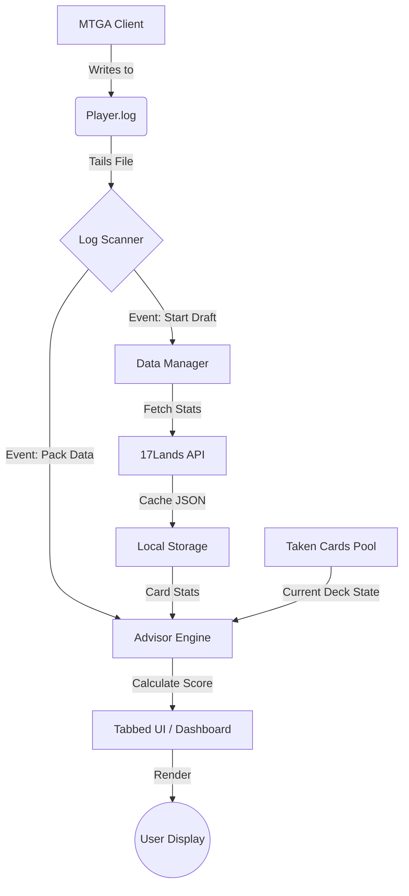

# System Overview & Architecture

**Status:** Draft | **Legacy Version:** Python 3.38 | **Target:** Migration Specification

## 1. Introduction

The MTGA Draft Tool is a reactive desktop overlay for Magic: The Gathering Arena (MTGA). It functions as a sidecar process that monitors local game logs to infer draft state and provides real-time statistical advice based on data from 17Lands.com.

## 2. Core Architecture

The system follows a uni-directional data flow.

## 3. Key Modules

| Module | Function | Dependencies | Criticality |
| :--- | :--- | :--- | :--- |
| **Log Scanner** | Tails `Player.log`, executes Regex matching, manages state machine (Idle -> Drafting -> Game). | OS File System | **High** (App fails without it) |
| **Data Manager** | Downloads/Caches set data. Handles fallback (if Premier data missing, use Quick data). | 17Lands API | **High** |
| **Advisor Engine** | The "Brain." Normalizes win-rates, calculates Z-Scores, applies "Lane Commitment" logic. | None (Pure Math) | **High** |
| **OCR Service** | **Edge Case:** Reads P1P1 (Pack 1 Pick 1) via screenshot because logs are delayed. | Google Cloud Functions | Medium |
| **Deck Suggester** | Algorithmic deck builder. Fits user's pool into "Aggro" or "Control" templates. | Card Logic | Low (Optional feature) |

## 4. Operational Lifecycle

### Phase B: The Draft Loop (Active)

The application polls for file changes every **1000ms**.

1. **State: Waiting for Event**
    * Listens for: `[UnityCrossThreadLogger]==> Event_Join`
    * Action: Identify Set Code (e.g., "OTJ"). Download/Load JSON stats from 17Lands.

2. **State: Pack Review**
    * Listens for: `Draft.Notify` containing `PackCards` array.
    * Action:
        1. Retrieve stats for `CardsInPack`.
        2. Retrieve stats for `TakenCards` (User's pool).
        3. Pass data to **Advisor Engine**.
        4. Render Overlay Table sorted by "Score".

3. **State: P1P1 (Pack 1 Pick 1)**
    * **The Gap:** MTGA often delays writing the log for the very first pack.
    * **User Action:** User clicks the **"P1P1"** button in the UI.
    * **System Action:** Takes a screenshot -> Sends to OCR Service -> Returns Card Names -> Updates UI.

4. **State: Pick Confirmation**
    * Listens for: `Event_PlayerDraftMakePick`.
    * Action: Move selected `GrpId` from "Pack" array to "TakenCards" array. Update "Signals" logic.

### Phase C: Shutdown

* Save window coordinates and column preferences to `config.json`.

## 5. Constraints & Invariants

1. **The P1P1 Gap:** MTGA does NOT write P1P1 pack data to the log immediately in Premier Drafts. The system MUST support a Screenshot/OCR fallback mechanism or the user sees nothing for the first pick.
2. **Rate Limiting:** 17Lands API requests must be cached for 24 hours. Do not fetch on every launch.
3. **Color Normalization:** All color strings must be sorted WUBRG (`GW` -> `WG`). The keys in 17Lands JSONs vary; the app must normalize them before lookup or data will appear missing.
