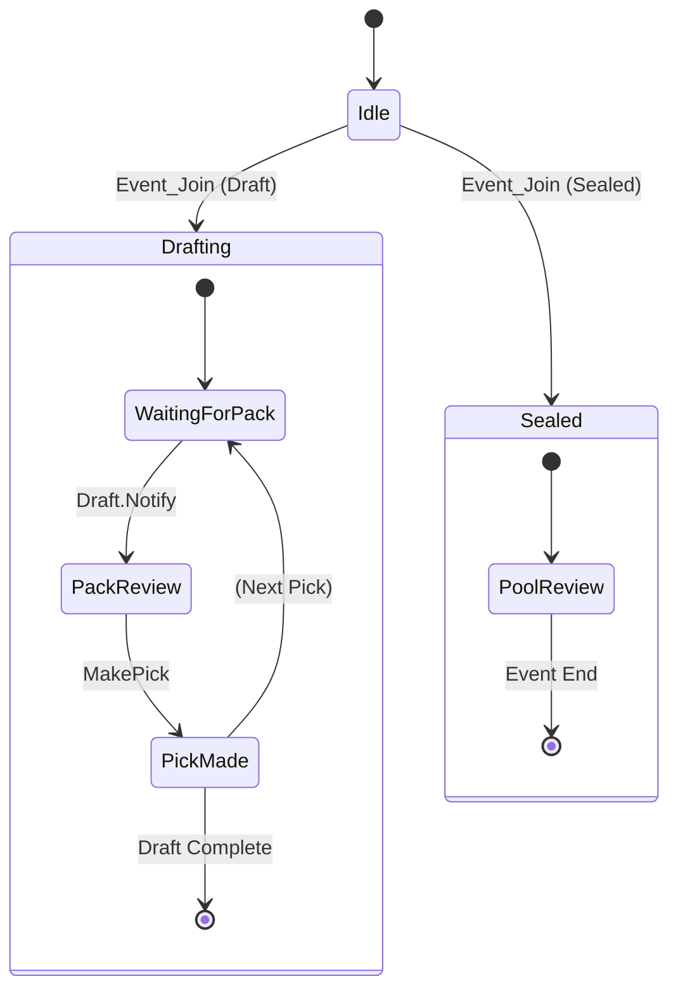

# Log Parsing Specification

**Status:** Critical Path | **Context:** Migration Logic

## 1. The Source: Player.log

The application monitors the Unity engine log generated by MTG Arena.

* **Encoding:** UTF-8
* **Format:** Unstructured text, but specific lines contain injected JSON payloads prefaced by `[UnityCrossThreadLogger]`.
* **Behavior:** The file grows indefinitely while the game is open. The parser **must** maintain a cursor (byte offset) to only process new lines.

## 2. Robust Matching Algorithm

The legacy Python application does **not** use strict string equality for detection. It uses a "Normalized Fuzzy Match" to survive minor Arena updates (e.g., changing `Event_Join` to `EventJoin`).

**The Algorithm (`src/utils.py` -> `detect_string`):**

1. Read line from log.
2. Normalize: Convert to UPPERCASE.
3. Strip: Remove all `_` (underscores) and ` ` (spaces).
4. Check: `if TARGET_KEYWORD in NORMALIZED_LINE`.
5. Extract: Find the first `{` character to begin JSON parsing.

> **Migration Requirement:** Do not rely on strict Regex. Implement this normalization strategy to ensure stability.

---

## 3. Event Catalog (Premier & Traditional Draft)

These are the signals for Human drafts (Premier/Traditional/Cube).

### A. Draft Start

* **Trigger String:** `Event_Join` (Normalized: `EVENTJOIN`)
* **JSON Payload:**

    ```json
    {
      "request": "{\"EventName\": \"PremierDraft_OTJ_20240416\", ...}"
    }
    ```

* **Logic:**
    1. Parse the nested `request` JSON string.
    2. Extract `EventName`.
    3. Split string by `_`.
    4. **Identify Set:** Look for known Set Codes (e.g., `OTJ`, `MH3`) in the segments.
    5. **Identify Type:** Look for `PremierDraft`, `TradDraft`, or `Sealed`.

### B. Pack Data (The "Draft Packet")

* **Trigger String:** `Draft.Notify` (Normalized: `DRAFT.NOTIFY`)
* **JSON Payload:**

    ```json
    {
      "draftId": "uuid...",
      "SelfPack": 1,
      "SelfPick": 2,
      "PackCards": "12345,67890,11121,..." // Comma-separated string of Integers
    }
    ```

* **Logic:**
    1. Parse `SelfPack` (1-3) and `SelfPick` (1-15).
    2. Split `PackCards` into an array of IDs.
    3. **State Update:** These IDs constitute the **Current Pack**. Send to Advisor Engine.

### C. Pick Confirmation

* **Trigger String:** `Event_PlayerDraftMakePick` (Normalized: `EVENTPLAYERDRAFTMAKEPICK`)
* **Legacy Trigger:** `Draft.MakeHumanDraftPick`
* **JSON Payload:**

    ```json
    {
      "request": "{\"GrpId\": 12345, \"Pack\": 1, \"Pick\": 2, ...}"
    }
    ```

* **Logic:**
    1. Extract `GrpId`.
    2. **State Update:** Remove `GrpId` from **Current Pack**. Add `GrpId` to **Taken Pool**.
    3. **Signals Update:** Calculate "Lateness" for this card relative to the pack it came from.

### D. The P1P1 Edge Case (Pack 1, Pick 1)

In Premier Drafts, Arena often writes the `Draft.Notify` log *too late* (after the user has already picked).

* **Backup Trigger:** `CardsInPack`
* **Constraint:** If this line is not found immediately, the UI will be empty.
* **Solution:** The new app **MUST** implement the Screenshot/OCR button to handle this gap. relying solely on logs for P1P1 is unreliable.

---

## 4. Event Catalog (Quick Draft / Bot Draft)

Bot drafts use a completely different internal module name (`BotDraft`).

### A. Draft Start

* **Trigger String:** `BotDraft_DraftStatus` (Normalized: `BOTDRAFTDRAFTSTATUS`)
* **Logic:** Same as Premier; parses `EventName`.

### B. Pack Data

* **Trigger String:** `DraftPack` (Found inside `BotDraft_DraftStatus` payload)
* **JSON Payload:**

    ```json
    {
      "DraftStatus": "PickNext",
      "DraftPack": [12345, 67890, ...], // Array of Integers (not string)
      "PackNumber": 0, // 0-indexed! (0 = Pack 1)
      "PickNumber": 0  // 0-indexed! (0 = Pick 1)
    }
    ```

* **Logic:**
    1. **Crucial:** Convert 0-indexed Pack/Pick to 1-indexed for the UI.
    2. Extract `DraftPack`.

### C. Pick Confirmation

* **Trigger String:** `BotDraft_DraftPick`
* **Payload:** Contains `CardId` (Singular).

---

## 5. Event Catalog (Sealed)

Sealed events dump the entire pool at once.

### A. Pool Generation

* **Trigger String:** `Event_Join`
* **Keyword Check:** Payload contains `CardPool`.
* **JSON Payload:**

    ```json
    {
      "Payload": {
        "Course": {
          "CardPool": [123, 124, 125, ...]
        }
      }
    }
    ```

* **Logic:**
    1. Extract `CardPool`.
    2. **State Update:** Set **Taken Pool** to this list immediately.
    3. Disable "Pack View" (No packs in sealed). Enable "Deck Builder" view.

---

## 6. State Machine Diagram

The parser implements the following State Machine to maintain integrity.



## 7. Migration Checklist

1. [ ] **File Watcher:** Implement a non-blocking file reader that remembers its cursor position (`seek`).
2. [ ] **Normalizer:** Implement the `UPPERCASE -> REMOVE "_" -> REMOVE " "` normalization function.
3. [ ] **JSON Sanitizer:** Arena logs often contain "Double JSON" (a string containing escaped JSON). The parser must handle `json.parse(json.parse(line).request)`.
4. [ ] **Index Correction:** Handle the 0-index (Quick Draft) vs 1-index (Premier) discrepancy.
